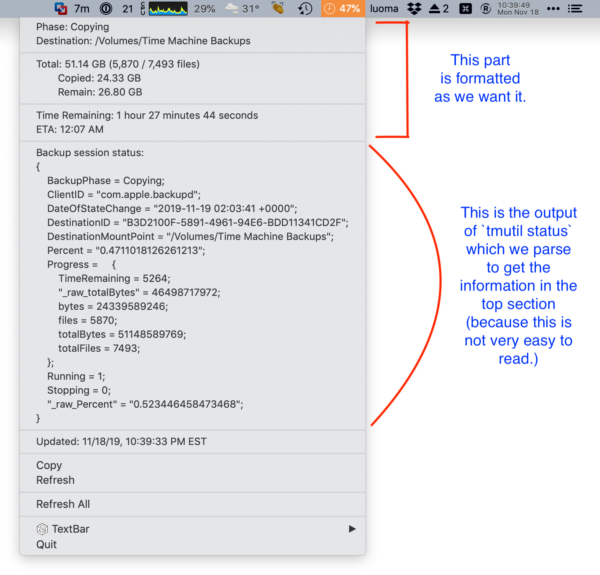

# textbar-timemachine

A [TextBar](http://richsomerfield.com/apps/textbar/) script to monitor the status of your Time Machine / Time Capsule backups.

-----

Here is what it looks like when a Time Machine backup is active:

Note the ‘47%’ in the menu bar. That’s the only part which is visible until I click on it.

The ‘47%’ represents how much of the backup is done.

When Time Machine is not backing up, there’s nothing shown there.

If there is another part of the Time Machine process happening, it will be shown there in a CamelCasedWord, such as:

* Copying
* DeletingOldBackups
* Finishing
* HealthCheckCopyHFSMeta
* HealthCheckFsck
* MountingBackupVol
* MountingBackupVolForHealthCheck
* Starting
* ThinningPostBackup
* ThinningPreBackup

(There may be others. Those are the only ones that I’ve noticed.)

Everything from the line ‘Backup session status’ down to ‘Updated’ is the output of the command `tmutil status` which gives you a lot of detail about what’s going on with your Time Machine backup, but it’s not in the most user-friendly or readable format.

The purpose of the script `textbar-timemachine.sh` is to parse `tmutil status` into the friendlier format shown at the top.

The files `bytes2readable.sh`, `commaformat.sh`, and `seconds2readable.sh` are all files that are used by `textbar-timemachine.sh`

## Some things to note:

- When the progress meter gets to about 90% it will stop, sometimes for a long time. Then it will say that it is finished. I’ve never seen it actually show anything above 90% completed.

- The Time Remaining can sometimes be off by a large margin, so I wouldn’t rely on it. Use it as a guide. (The “ETA” is simply a calculation of the “Time Remaining” added to the current time, so if one is wrong, the other will be too.)

- I have often seen Time Machine claiming to backup far more data than I have on my drive, sometimes far more data than could fit on my drive if it was 100% full (even when it was mostly empty). Try not to worry about that. It's normal.

## Potential Bugs

I have tested this script with _one_ local Time Machine drive (that is, a drive that I physically attach to my Mac) and one Time Capsule drive (a network location).

However, you could have multiple local drives, or multiple Time Capsule drives. If that happens, parts of this script might get confused, but the basic functionality of monitoring the process should still work fine.

